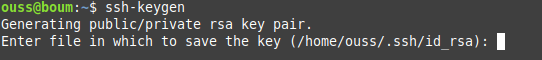
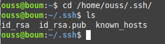
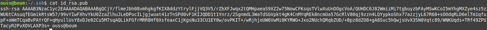
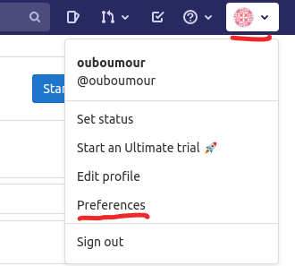
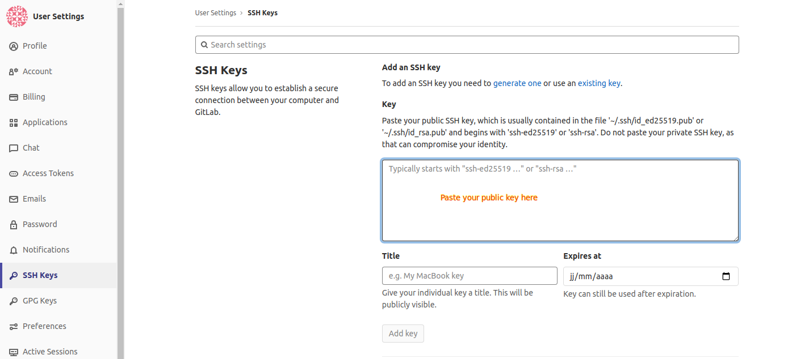

# How to create an SSH key and make the link in gitlab

----------------------
1. Open your terminal.
--------------------

2. Tape to generate an ssh key the command :  
    > ssh-keygen   
   
   PS : Hit enter for each other asked information.
     
   
   
-----------------
3. put the public key in the SSH Keys section.

